# Capítulo II: Requirements Elicitation & Analysis {#capítulo-ii-requirements-elicitation-analysis}

## 2.1. Competidores {#competidores}

### 2.1.1. Análisis competitivo {#analisis-competitivo}

| Sección | Criterio | SoftWork | Officevibe | Culture Amp | 15Five |
|:---|:---|:---|:---|:---|:---|
| **Perfil** | Overview | Plataforma de contacto y análisis basada en encuestas, foro y análisis organizacional. | Plataforma de engagement basada en encuestas rápidas y feedback continuo. | Plataforma avanzada de análisis de clima laboral y cultura organizacional. | Software de desempeño con enfoque en feedback continuo y objetivos (OKRs). |
| | Ventaja Competitiva | Simplicidad y costeable por empresas de diversas magnitudes | Simplicidad y facilidad de uso en encuestas semanales. | Potente analítica y benchmarking global. | Integración de desempeño, objetivos y seguimiento del empleado. |
| **Marketing** | Mercado objetivo | Empresas medianas o grandes | Empresas medianas y grandes. | Corporaciones globales. | Empresas que buscan analizar desempeño. |
| | Estrategia | Branding y marketing direccionado a redes sociales. | Marketing digital enfocado en HR tech. | Branding + estudios organizacionales. | Contenido educativo y enfoque en managers. |
| **Producto** | Servicios | Encuestas, personalización de usuario, dashboards, foros de trabajo | Encuestas, feedback anónimo, reportes básicos. | Encuestas, analítica avanzada, planes de acción. | Evaluaciones, seguimiento de objetivos, feedback continuo. |
| | Precios & Costos | Suscripción por usuario | Suscripción por usuario. | SaaS con precios elevados. | Suscripción escalable por usuario. |
| | Canales de distribución | App móvil | Web + app móvil. | Web + app móvil. | Web + app móvil. |
| **SWOT** | Fortalezas | Integración sencilla. | Fácil adopción. | Alto nivel de análisis. | Plataforma integral de talento. |
| | Debilidades | Disponible solo para app móvil | Funcionalidad limitada. | Alto costo. | Complejidad para equipos pequeños. |
| | Oportunidades | Monitoreo específico y posiblemente tercerizado. | Crecimiento del trabajo remoto. | Expansión global. | Tendencia hacia OKRs. |
| | Amenazas | Mercado ya establecido | Competencia más completa. | Nuevas startups. | Mercado saturado. |

---

### 2.1.2. Estrategias y tácticas frente a competidores {#estrategias-tacticas-competidores}

Frente a los competidores existentes en el mercado de bienestar laboral y gestión de clima organizacional, **SoftWork** busca diferenciarse mediante una propuesta centrada en la **privacidad, accesibilidad y análisis inteligente de datos**. A diferencia de otras plataformas, SoftWork integra comunicación activa, feedback continuo y herramientas de acompañamiento. Además, puede integrar equipos de RRHH de diversas empresas para que analicen el clima laboral de cualquier tipo de empresa.  

Frente a diversos competidores ya establecidos en el mercado, Soft adopta una estrategia basada en:  

- Simplicidad y accesibilidad, facilitando su implementación en empresas medianas.  
- Enfoque en acción inmediata, no solo medición, permitiendo resolver problemas en tiempo real.  
- Cercanía con el usuario, promoviendo comunicación directa entre empleados y RRHH.  
- Adaptación al contexto local, considerando dinámicas laborales más informales o tradicionales.  

De esta forma, SoftWork busca diferenciarse como una herramienta práctica, humana y accesible para mejorar el entorno laboral de manera continua.  

## 2.2. Entrevistas {#entrevistas}

### 2.2.1. Diseño de entrevistas {#diseno-entrevistas}

Para el diseño de entrevistas se han definido dos bloques de preguntas diferenciadas por segmento: empleados y área de Recursos Humanos (RRHH).

Se aplican buenas prácticas como:
- Uso de preguntas abiertas para obtener respuestas profundas.
- Lenguaje claro y cercano para generar confianza.
- Estructura flexible que permita explorar insights inesperados.
- Enfoque en experiencias reales más que en respuestas ideales.

El objetivo principal es recolectar información clave para construir arquetipos sólidos, considerando:
- Variables demográficas y laborales
- Comportamiento dentro del entorno de trabajo
- Uso de herramientas digitales
- Motivaciones, frustraciones y necesidades
- Percepción sobre apoyo organizacional

---

### Segmento 1: Empleados de la empresa

### Objetivo
Comprender la experiencia del empleado dentro de la organización, su percepción sobre bienestar y desempeño laboral, cómo enfrenta dificultades y su disposición a usar herramientas digitales de apoyo.

**Segmento 1: Empleados**

**Introducción:**  
“Buenos días/tardes/noches, mi nombre es ‘Nombre del entrevistador’. Actualmente estamos desarrollando una aplicación orientada a mejorar el ambiente laboral con una mejor comunicación con Recursos Humanos. Nos gustaría conocer su experiencia y opinión a través de algunas preguntas.”  

**Preguntas:**

1. ¿Cómo describirías el ambiente laboral en tu área actualmente?  
2. ¿Has tenido alguna incomodidad o problema en algún trabajo que hayas tenido? ¿Cómo lo manejaste?  
3. ¿Sientes que quizás estás un poco limitado para expresar tus opiniones o preocupaciones?  
4. ¿Cuentas con un área de Recursos Humanos en tu empresa? De ser así, ¿qué tan accesible es?  
5. ¿Qué medios utilizas actualmente para comunicar problemas laborales? (ej. jefe directo, RRHH, chat, etc.)  
6. ¿Has participado en encuestas de clima laboral? ¿Con qué frecuencia?  
7. ¿Consideras que la comunicación en tu ambiente laboral ha mejorado?  
8. ¿Qué tan útil sería para ti una app donde puedas comunicar problemas y recibir respuesta?  
9. ¿Qué funcionalidades te gustaría que tenga una aplicación de este tipo?  
10. ¿Te sentirías cómodo utilizando una app móvil para estos fines? ¿Por qué?  
11. ¿Crees que mejorar el ambiente laboral impacta en tu productividad? ¿Cómo?  

---

**Segmento 2: Recursos Humanos**

**Introducción:**  
“Buenos días/tardes/noches, mi nombre es ‘Nombre del entrevistador’. Estamos desarrollando una aplicación que busca mejorar el clima laboral mediante herramientas de feedback, comunicación directa y análisis de datos para RRHH. Nos gustaría conocer su experiencia para validar esta propuesta.”  

**Preguntas:**

1. ¿Cómo evalúan actualmente el clima laboral en la empresa?  
2. ¿Utilizan medios digitales para recopilar feedback de los empleados? De ser así, ¿podría mencionar estos medios?  
3. ¿Con qué frecuencia realizan encuestas o evaluaciones de clima laboral?  
4. ¿Considera que es complicado gestionar el clima laboral y lograr mejorarlo?  
5. ¿Qué tan rápido pueden actuar frente a un problema detectado?  
6. ¿Cómo gestionan la comunicación con empleados que presentan incomodidades?  
7. ¿Qué tipo de indicadores consideran más importantes en sus análisis?  
8. ¿Obtienen reportes visuales basados en los resultados de los indicadores mencionados?  
9. ¿Qué tan útil sería tener un dashboard automatizado en tiempo real sobre el estado del clima laboral?  
10. ¿Qué funcionalidades consideran indispensables en una solución como esta?  
11. ¿Estarían dispuestos a invertir en implementar una herramienta digital para mejorar el clima laboral? ¿Por qué?  

---

### Consideraciones clave

- Garantizar anonimato para obtener respuestas sinceras.
- Permitir profundización en respuestas relevantes durante la entrevista.
- Identificar patrones comunes entre ambos segmentos.
- Validar supuestos del problema planteado en el proyecto.

---

### Insight esperado

Se busca identificar la brecha entre:
- La percepción del empleado sobre el apoyo recibido
- La capacidad real de RRHH para brindar soluciones efectivas

Esto permitirá diseñar una solución más alineada a necesidades reales y no supuestas.

### 2.2.2. Registro de entrevistas {#registro-entrevistas}

**Segmento 1: Empleados**
##### Entrevista N°1: Ailmeida Aguilar
- Sexo: Masculino
- Edad: 23 años
- Dirección: Lima, San Miguel.

**Link De la Entrevista:** **https://upcedupe-my.sharepoint.com/personal/u202114548_upc_edu_pe/_layouts/15/stream.aspx?id=%2Fpersonal%2Fu202114548%5Fupc%5Fedu%5Fpe%2FDocuments%2FMobiles%5FG2%2Fvideo1429593775%2Emp4&referrer=StreamWebApp%2EWeb&referrerScenario=AddressBarCopied%2Eview%2Ec6e3db4b%2D35ca%2D4820%2D9413%2D4b88f04ad57e** 
Duracion:**00:06:13**&nbsp;&nbsp;&nbsp;&nbsp;&nbsp;Inicio:**00:00:02**&nbsp;&nbsp;&nbsp;&nbsp;Final:**00:06:13**
Almeida es un trabajador que percibe su ambiente laboral como generalmente tranquilo, pero con momentos de alta presión y una comunicación poco clara con sus líderes. Señala dificultades para expresar problemas por temor a juicios o repercusiones, y percibe a Recursos Humanos como poco accesible y enfocado en lo administrativo. Aunque participa en encuestas de clima laboral, siente desmotivación por la falta de retroalimentación. Valora la posibilidad de una aplicación que le permita comunicar situaciones de forma confidencial, hacer seguimiento y mejorar la interacción, destacando que un mejor clima laboral impactaría positivamente en su motivación y productividad.

##### Entrevista N°2: Alexandro Bravo
- Sexo: Masculino
- Edad: 21 años
- Dirección: Lima, San Miguel.

**Link De la Entrevista:** **[https://upcedupe-my.sharepoint.com/personal/u202114548_upc_edu_pe/_layouts/15/stream.aspx?id=%2Fpersonal%2Fu202114548%5Fupc%5Fedu%5Fpe%2FDocuments%2FMobiles%5FG2%2Fvideo1429593775%2Emp4&referrer=StreamWebApp%2EWeb&referrerScenario=AddressBarCopied%2Eview%2Ec6e3db4b%2D35ca%2D4820%2D9413%2D4b88f04ad57e](https://upcedupe-my.sharepoint.com/personal/u202114548_upc_edu_pe/_layouts/15/stream.aspx?id=%2Fpersonal%2Fu202114548%5Fupc%5Fedu%5Fpe%2FDocuments%2FMobiles%5FG2%2FEntrevista%5FEmpleados%5F02%2Emp4&referrer=StreamWebApp%2EWeb&referrerScenario=AddressBarCopied%2Eview%2E4e471350%2D19d2%2D4667%2D8736%2D2803f5042523&mode=Edit)** 
Duracion:**00:06:37**&nbsp;&nbsp;&nbsp;&nbsp;&nbsp;Inicio:**00:00:02**&nbsp;&nbsp;&nbsp;&nbsp;Final:**00:06:37**
Alessandro es un trabajador que percibe su ambiente laboral como estable y cómodo, aunque con momentos de sobrecarga y dificultades en la comunicación, especialmente con niveles jerárquicos superiores y otras áreas. Señala que sus opiniones no siempre son consideradas y que Recursos Humanos resulta poco accesible y lento en la gestión de solicitudes. Aunque la comunicación dentro de su equipo es buena, identifica falta de integración entre áreas. Valora la idea de una aplicación móvil interactiva que facilite la comunicación entre empleados y con la empresa, destacando que un mejor ambiente laboral incrementaría la comodidad y la productividad.
**Entrevista 3: Diego Bullón**
- Sexo: Masculino
- Edad: 22 años
- Link : [Enlace](https://upcedupe-my.sharepoint.com/:v:/g/personal/u202114548_upc_edu_pe/IQDmh2AHjqLAQYOMxGj6E7ySAStWw66KWxCu0V6rcKm9ZBU?e=t2W23a&nav=eyJyZWZlcnJhbEluZm8iOnsicmVmZXJyYWxBcHAiOiJTdHJlYW1XZWJBcHAiLCJyZWZlcnJhbFZpZXciOiJTaGFyZURpYWxvZy1MaW5rIiwicmVmZXJyYWxBcHBQbGF0Zm9ybSI6IldlYiIsInJlZmVycmFsTW9kZSI6InZpZXcifX0%3D) 
- Inicia en : 0:01
- Duración: 6:35

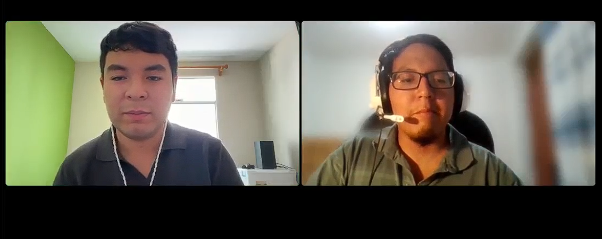

**Resumen de la Entrevista**

Diego es un empleado para una empresa bancaria. El describe su ambiente laboral como un ambiente cómodo donde no encontró ningún tipo de problema con compañeros y/o superiores. Resalta que el ambiente en el que se encuentra trabajando es muy atento a lo que los trabajadores necesitan. Dice que la gerencia de RRHH de su empresa se preocupa por estar atento a ¿Cómo retener al trabajador? y facilitar trámites. Cuenta que cuenta con comunicación con sus superiores por medio de otras herramientas. Además, Diego resalta que las encuestas realizadas son directamente proporcionadas por el jefe mas no el área de RRHH. Diego resalta que una aplicación móvil como SoftWork puede ser útil para poder comunicar ciertos malestares o un retiro temprano de la jornada laboral. Diego busca que la relación entre los trabajadores y los gerentes de RRHH sea mucho más directa.

**Segmento 2: Recursos Humanos**
### 2.2.3. Análisis de entrevistas {#analisis-entrevistas}

En este apartado se procederá a analizar las entrevistas realizadas

Segmento #1:
Total de entrevistas: 3

Datos sobre preguntas:
- El 67% de empleados considera util el uso de una app para su entorno laboral.
- Los 3 entrevistados consideran de dificultad Media el acceso a la comunicación con RRHH
- 2 entrevistados comentan que el ambiente es regular y 1 solo considera que el clima laboral es bueno

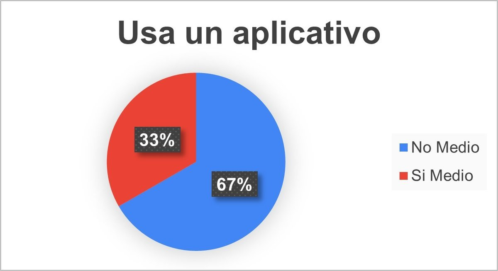
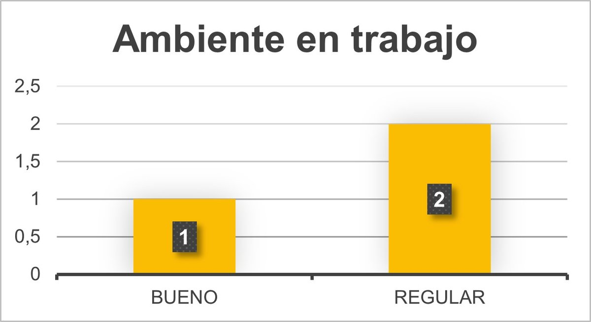
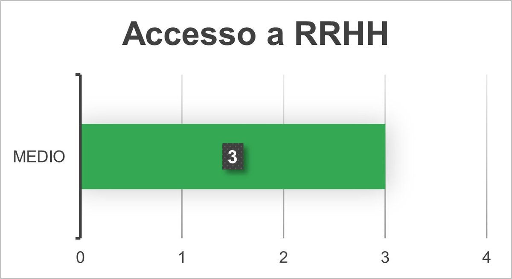

Segmento #2:
Total de entrevistas: 3

Datos sobre preguntas:
- El 100% de personal de RRHH utiliza una app para desempeñarse en su entorno laboral.
- Ante un problema, el 67% de entrevistados considera que el tiempo de respuesta es Lento mientras que el 33% lo considera Moderado
- 2 entrevistados realizan encuestas frecuentemente mientras que uno lo hace ocasionalmente

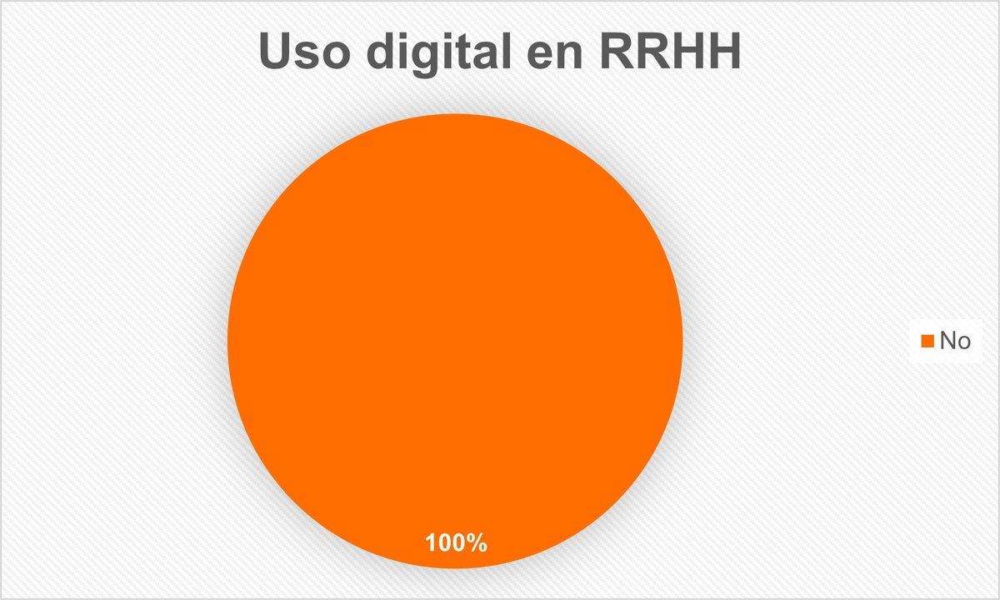
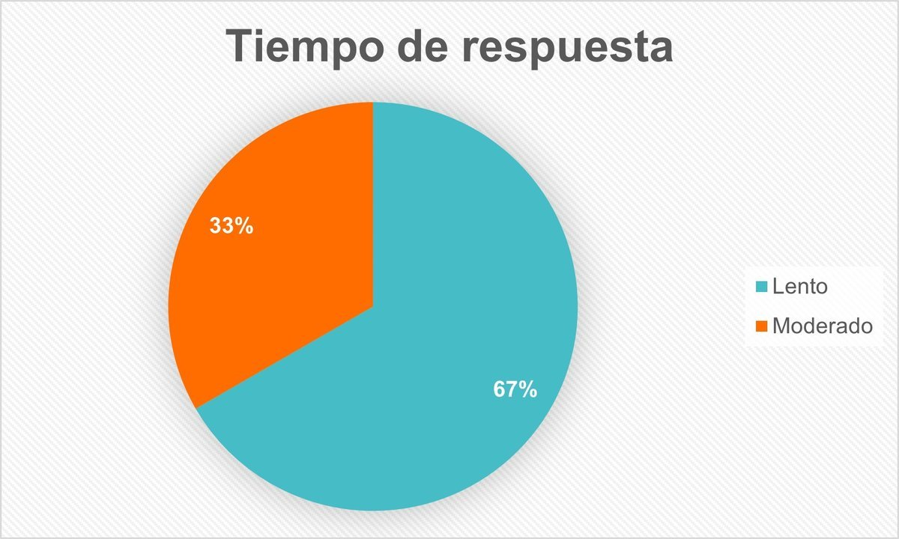
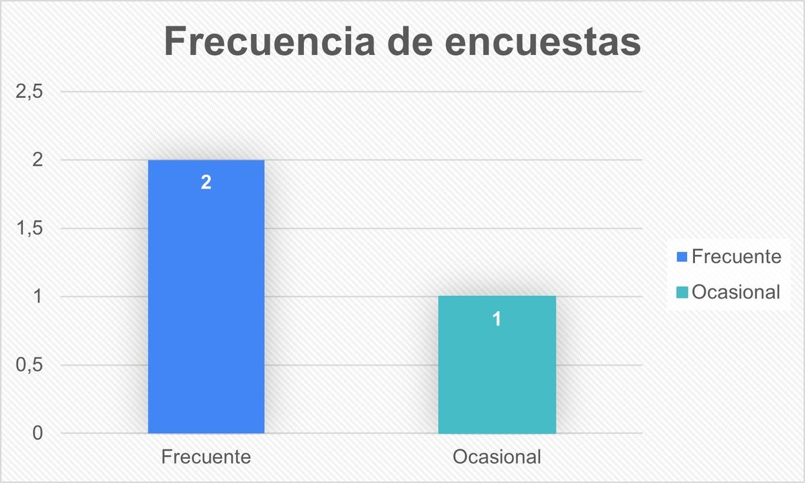

## 2.3. Needfinding {#needfinding}

### 2.3.1. User Personas {#user-personas}

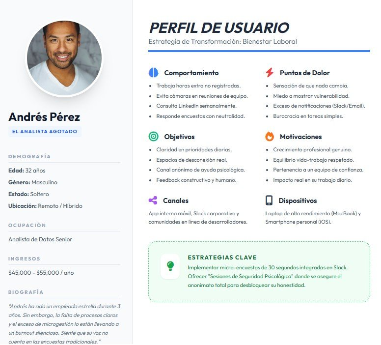
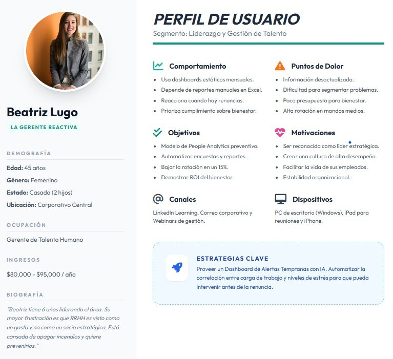

### 2.3.2. User Task Matrix {#user-task-matrix}
La matriz de tareas nos permite visualizar qué acciones realizan nuestros usuarios y con qué frecuencia o importancia. Esto es crucial para priorizar las funcionalidades de tu solución tecnológica.

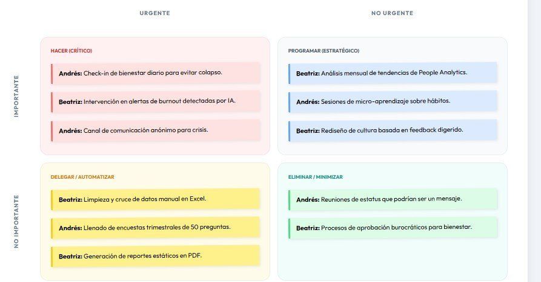   

| Tarea / Acción                              | Frecuencia | Prioridad | Beatriz (RRHH)      | Andrés (Empleado)   |
|--------------------------------------------|------------|-----------|---------------------|---------------------|
| Reportar estado de ánimo                   | Diaria     | Alta      | -                   | Acción principal     |
| Consolidación de datos/reportes            | Semanal    | Alta      | Acción principal    | -                   |
| Solicitud de ayuda/soporte                 | Ocasional  | Crítica   | -                   | Acción necesaria     |
| Identificación de patrones burnout         | Mensual    | Alta      | Acción principal    | -                   |
| Intervención ante conflicto                | Eventual   | Crítica   | Acción principal    | -                   |
| Consumo de contenido (micro-learning)      | Diario     | Media     | -                   | Acción deseada       |

### 2.3.3. User Journey Mapping {#user-journey-mapping}
Este mapa visualiza el proceso actual de "Detección de Malestar". Nos ayuda a identificar los puntos de fricción donde el sistema actual (basado en encuestas anuales) falla para ambos perfiles.

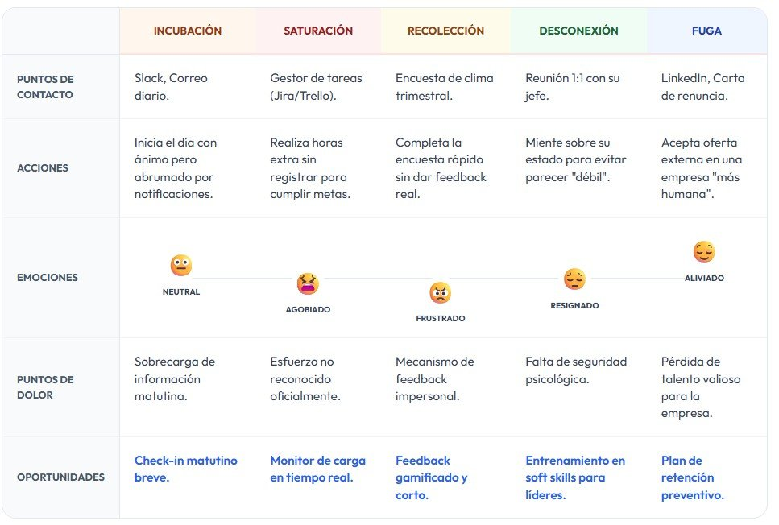       

### 2.3.4. Empathy Mapping {#empathy-mapping}
Esta herramienta nos permite ir más allá de lo que hacen, entendiendo qué los motiva y qué los frena.

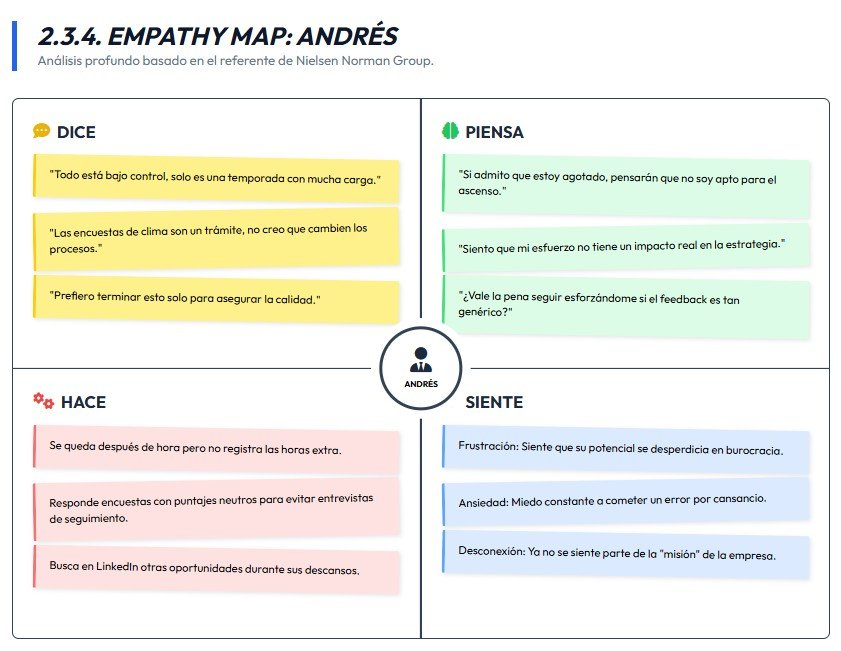                                                              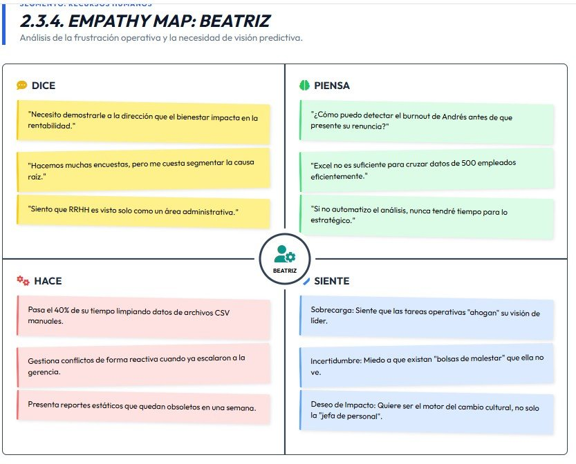  
---

### Para Andrés (El Empleado)

- **¿Qué dice?**  
  "Estoy bien, solo es una semana pesada."

- **¿Qué piensa?**  
  "Si pido ayuda, pensarán que no soy capaz de manejar mi carga."

- **¿Qué hace?**  
  Trabaja horas extra en silencio; evita reuniones de feedback.

- **¿Qué siente?**  
  Ansiedad, miedo al juicio, desilusión profesional.

---

### Para Beatriz (La Gerente)

- **¿Qué dice?**  
  "Necesito más datos para tomar decisiones estratégicas."

- **¿Qué piensa?**  
  "Siempre me entero de los conflictos cuando ya es irreparable."

- **¿Qué hace?**  
  Exporta datos a Excel, intenta cruzar variables manualmente (sobrecarga).

- **¿Qué siente?**  
  Frustración por su falta de proactividad, estrés por la incertidumbre.

### 2.3.5. As-is Scenario Mapping {#as-is-scenario-mapping}
## Etapas del proceso "As-Is" (Estado actual)

### Activación
- **Andrés:** Siente agotamiento (burnout) → Oculta el sentimiento (miedo a parecer incompetente).
- **Beatriz:** No recibe ninguna señal temprana.

### Procesamiento
- **Beatriz:** Envía encuesta anual → **Andrés** la completa mecánicamente (desconfianza).

### Clímax del Problema
- **Andrés:** El malestar escala en silencio.
- **Beatriz:** Recibe resultados consolidados 30 días después → Detecta el problema cuando ya es tarde (renuncia o conflicto agudo).

### Resolución (Estado actual)
- Gestión reactiva, parches administrativos y falta de conexión emocional.

---

### Oportunidad de diseño
- Insertar un punto de contacto digital continuo que permita a **Andrés** expresar su malestar de forma segura y a **Beatriz** recibir alertas accionables, no reportes estáticos.

### Segmento 1: Empleados de la empresa

| Fase | Acciones (Doing) | Pensamientos (Thinking) | Emociones (Feeling) |
|:---|:---|:---|:---|
| Inicio del problema | Percibe dificultades en su desempeño o bienestar laboral. Recibe feedback informal o detecta estrés. | "Siento que algo no está funcionando bien, pero no sé exactamente qué es." | Incertidumbre, estrés leve |
| Búsqueda de ayuda | Consulta con compañeros, busca información en internet o revisa recursos internos. | "Quizá esto es normal... pero debería hacer algo al respecto." | Duda, curiosidad |
| Evaluación de opciones | Considera acudir a RRHH o usar herramientas internas (si existen). | "No sé si esto es lo suficientemente importante como para escalarlo." | Inseguridad, temor |
| Interacción con RRHH | Contacta a RRHH o responde encuestas internas. Expone parcialmente su situación. | "Espero que esto realmente sirva y no afecte mi imagen." | Ansiedad, desconfianza |
| Seguimiento | Recibe retroalimentación limitada o genérica. Puede o no aplicar recomendaciones. | "No estoy seguro si esto realmente me ayuda a mejorar." | Frustración, desmotivación |
| Resultado actual | Continúa con el problema parcialmente resuelto o sin cambios significativos. | "Tal vez solo tengo que adaptarme..." | Resignación, agotamiento |

---

### Segmento 2: Área de Recursos Humanos (RRHH)

| Fase | Acciones (Doing) | Pensamientos (Thinking) | Emociones (Feeling) |
|:---|:---|:---|:---|
| Detección de necesidades | Recibe reportes, resultados de encuestas o quejas informales. | "Hay señales de problemas, pero no tengo toda la información." | Preocupación, presión |
| Recolección de información | Aplica encuestas, entrevistas o revisa indicadores de desempeño. | "Los datos son limitados o poco claros para tomar decisiones." | Incertidumbre |
| Análisis | Interpreta datos de forma general, identifica patrones básicos. | "Necesito herramientas más precisas para entender esto mejor." | Frustración, carga mental |
| Diseño de acciones | Propone capacitaciones, talleres o intervenciones generales. | "Espero que estas soluciones funcionen para la mayoría." | Duda, responsabilidad |
| Implementación | Ejecuta programas o comunica iniciativas a los empleados. | "No sé si todos realmente participarán o se beneficiarán." | Estrés, presión operativa |
| Evaluación de impacto | Revisa resultados de forma superficial o a corto plazo. | "Es difícil medir el impacto real de lo que hacemos." | Insatisfacción, incertidumbre |

---

### Pain Points (Áreas críticas identificadas)

#### Para empleados:
- Falta de claridad sobre cómo identificar y abordar sus problemas.
- Miedo a expresar situaciones personales o laborales.
- Soluciones poco personalizadas o superficiales.
- Escaso seguimiento continuo.

#### Para RRHH:
- Información fragmentada y poco profunda.
- Falta de herramientas analíticas avanzadas.
- Limitaciones de tiempo para atención individual.
- Dificultad para medir impacto real de sus acciones.

---

### Insight clave

Existe una **desconexión entre la necesidad real del empleado y la capacidad de respuesta de RRHH**, causada principalmente por:
- Falta de datos profundos
- Procesos reactivos en lugar de predictivos
- Baja personalización en las soluciones

## 2.4. Ubiquitous Language {#ubiquitous-language}

A continuación, se define el lenguaje ubicuo (*Ubiquitous Language*) del proyecto **SoftWork**. Este vocabulario compartido garantiza un entendimiento común entre los miembros del equipo de desarrollo, los expertos en el dominio y los usuarios finales.

**1. Stakeholders & Roles**

- **User / UserAccount:** Entidad que representa la cuenta y perfil de acceso de un usuario registrado en el sistema.
- **Role (Rol):** Nivel de autorización en la aplicación. Existen principalmente dos: `ANONYMOUS_USER` y `RRHH_MANAGER`.
- **Anonymous User (Trabajador):** Tipo de usuario que representa al empleado de una empresa. Su identidad se mantiene oculta para garantizar que pueda expresar sus problemas, quejas e ideas laborales libremente sin miedo a represalias.
- **RRHH Manager (Recursos Humanos):** Usuario administrador que monitorea el feedback de los empleados. Tienen la facultad de ver métricas organizacionales y enviar propuestas, soluciones y comunicados para mejorar el clima laboral.

**2. Funcionalidades de la Plataforma**

- **Department Category (Categoría de Departamento):** Clasificación que permite organizar y agrupar los hilos de discusión según las distintas áreas o departamentos de una empresa.
- **Thread (Hilo de discusión):** Espacio virtual donde los usuarios publican y discuten sobre problemáticas o temas específicos del ambiente laboral de manera anónima.
- **Message (Mensaje):** Publicación textual que expresa el feedback, problema u opinión de un empleado dentro de un hilo o en la interacción asistida por Inteligencia Artificial.
- **Dashboard (Panel de Control):** Interfaz exclusiva para los perfiles de `RRHH_MANAGER`, donde pueden visualizar de forma resumida el estado emocional y problemático de las áreas de trabajo a través de métricas y gráficos.
- **Activity Widget:** Componentes visuales dentro del panel de control (*Bar Chart*, *Pie Chart*, *Heatmap*) que traducen los datos abstraídos en representaciones gráficas interactivas.
- **Analytic System (Sistema Analítico):** Módulo inteligente que evalúa los datos recopilados para identificar tópicos en tendencia, respuestas conductuales y puntajes de sentimiento laboral (*Sentiment Score*).
- **Announcement Manager (Gestor de Anuncios):** Módulo que permite al gestor u oficial de Recursos Humanos emitir mensajes públicos masivos y plantear encuestas de satisfacción.

**3. Otros conceptos del dominio**

- **Data Recopiled (Datos Recopilados):** Conjunto de mensajes y comportamientos recolectados como materia prima para ser analizados posteriormente.
- **Notification (Notificación):** Alertas del sistema sobre nuevos comentarios, cambios o anuncios emitidos.
- **Membership (Membresía):** Suscripción adquirida por las empresas cliente (B2B) que determina el servicio, con estados de validación como `ACTIVE`, `CANCELLED` o `EXPIRED`.
- **Membership Plan:** Paquetes que ofrecen distintos niveles de funcionalidades (Beneficios) dependiendo de la necesidad empresarial.
- **Payment (Transacción):** Modelo de liquidación implementado mediante diversos procesadores y estrategias de pago (Tarjetas, PayPal) en la contratación de los servicios de Elysium.
