# Capítulo IV: Solution Software Design {#capítulo-iv-solution-software-design}

## 4.1. Strategic-Level Domain-Driven Design {#strategic-level-domain-driven-design}
 
### 4.1.1. EventStorming {#eventstorming}
Para esta sección ocupamos la herramienta de Miro y realizamos el Event Storming a cada una de los Bounded Context definidos en los que se vana  trabajar.

#### - IAM (Identity and Access Management)
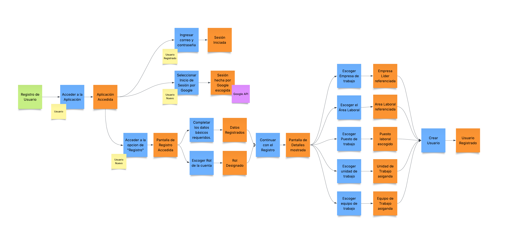

#### - Membership and Payments
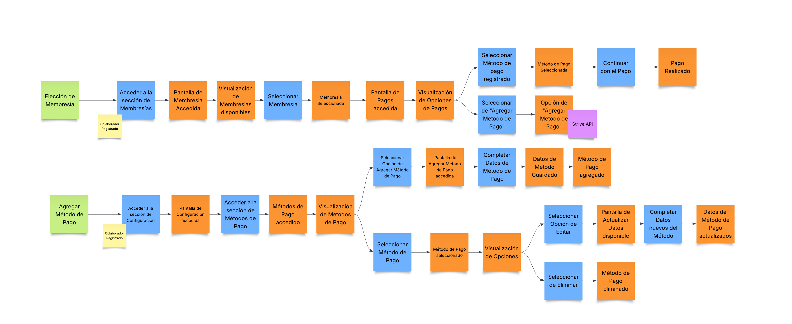

#### - Dashboard and Analytics
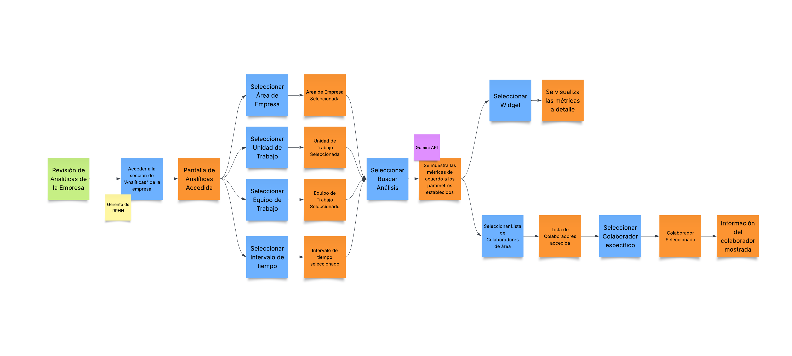

#### - Workers Forum

#### - Feedback For Employees
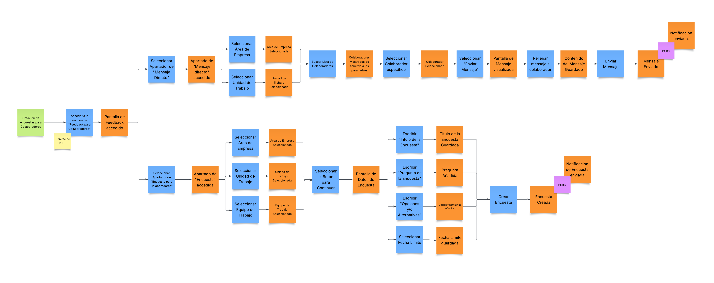

#### 4.1.1.1. Candidate Context Discovery {#candidate-context-discovery}
En esta sección aplicamos la técnica de Candidate Discovery para identificar y separar los posibles Bounded Context. Esto divide el trabajo en subramas donde se trabajan ciertas funcionalidades por separado.

Con esto, nos llevó a crear los iguientes Bounded Context:

| Bounded Context | Descripción | Eventos Clave |
| :--- | :--- | :--- |
| IAM | Contexto donde se manejan el acceso a la aplicación, la asignación de roles y las verificacion de usuarios.| s|
| Membership and Payments | Contexto donde se maneja los pagos dentro de la aplicación y la asignación de las membresías de los usuarios. | a |
| Dashboard and Analytics | Contexto donde se manejan los dashboard y los análisis de los trabajadores y su rendimiento dentro del ambiente laboral. |a |
| Workers Forum | Contexto donde los usuarios pueden compartir sus experiencias y mandar mensajes a los usuarios dentro de un entorno de trabajo.  | a |
| Feedback for Employees | Contexto donde los gerentes de RRHH pueden realizar distintas encuestas a los usuarios y recabar información sobre el entorno laboral | a |
 
#### 4.1.1.2. Domain Message Flows Modeling {#domain-message-flows-modeling}

El Domian Massage Flow Modelling es una técnica que nos permite representar cómo fluyen los mensjaes de dominios (comandos, eventos y consultas) entre los distintos Bounded Context. Esto se hace con el objetivo de especificar dentro del entorno las dependencias y responsabilidades de cada uno de los contextos.

<b>Escenario 01: Mandar un nuevo mensaje en el foro</b>

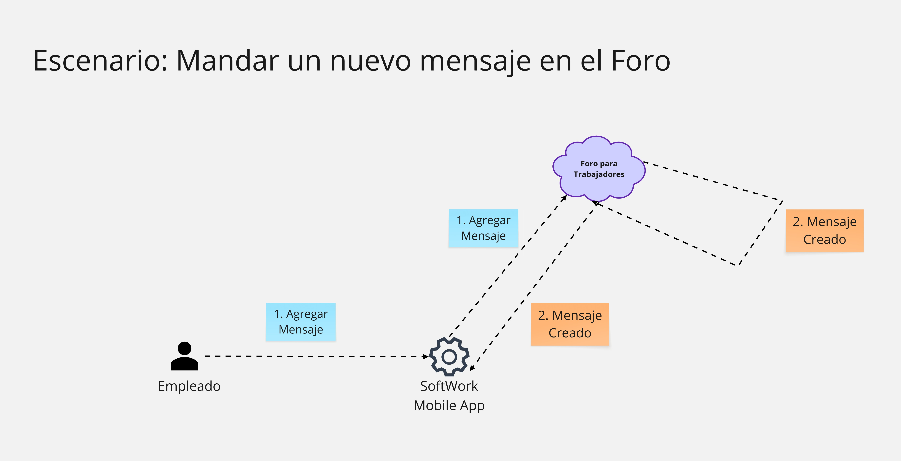

<b>Escenario 02: Editar mensaje en el foro</b>

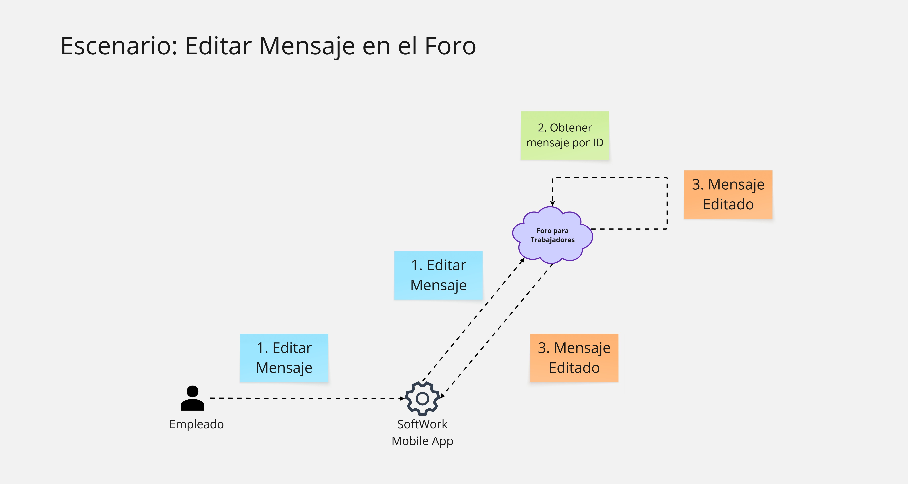

<b>Escenario 03: Creación de encuestas para Trabajadores</b>

<b>Escenario 04: Envio de mensajes directos a trabajadores</b>

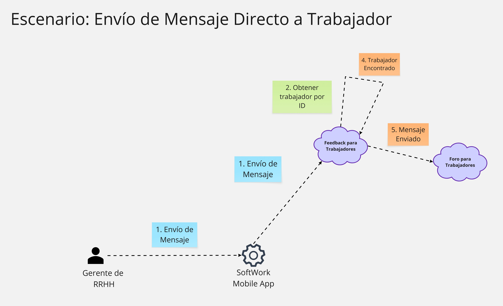

<b>Escenario 05: Solicitar Reporte de encuestas dentro de un periodo determinado</b>

#### 4.1.1.3. Bounded Context Canvases {#bounded-context-canvases}

El Bounded Context Canvas es una herramienta que se aplica dentro del marco del DDD (Domain-Driven-Design) que nos permite representar de manera clara los límites, las responsabilidades e interacciones de cada contexto dentro de un sistema que puede llegar a ser complejo. 

En esta sección se representan los Bounded Context Canvases correspondientes a los contextos identificados dentro de nuestra aplicación:

#### - IAM (Identity and Access Management)

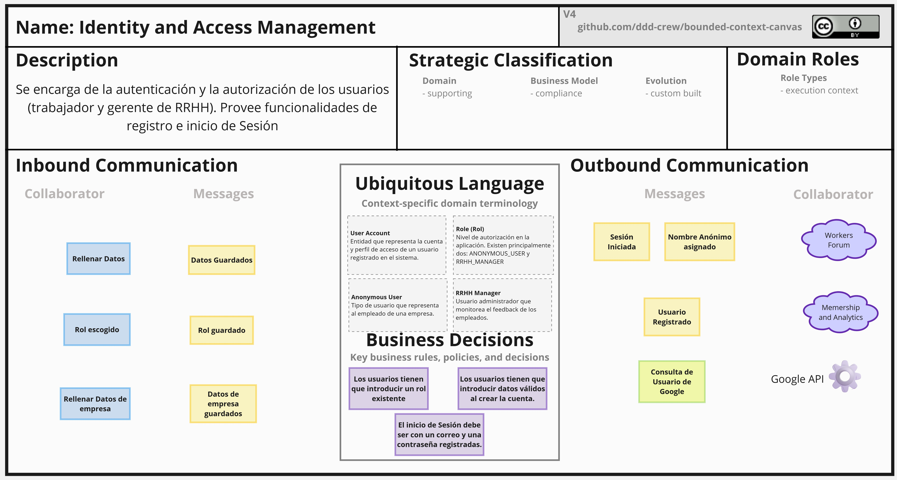

#### - Membership and Payments

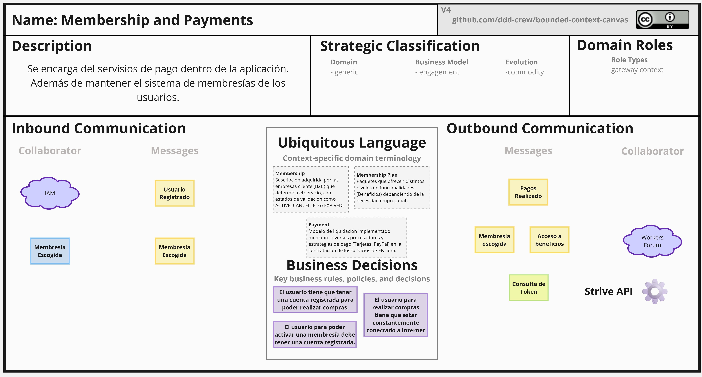

#### - Dashboard and Analytics
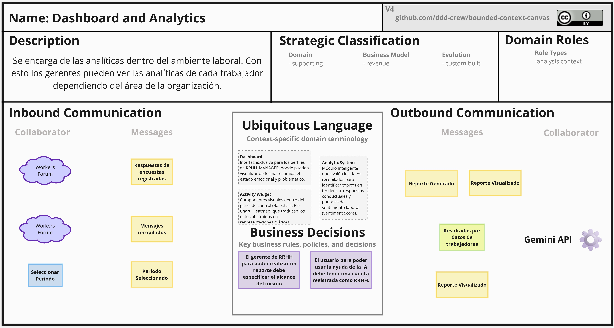

#### - Workers Forum
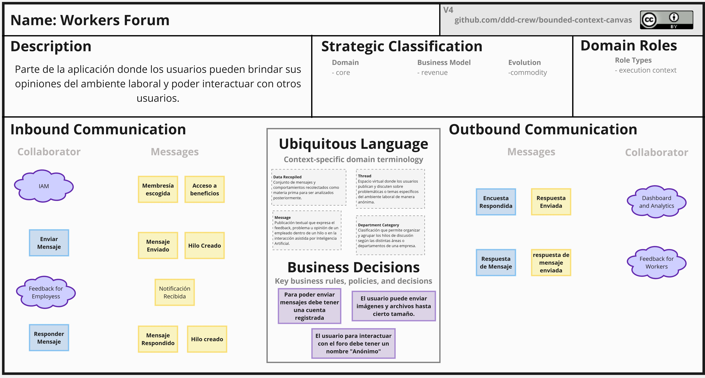

#### - Feedback For Employees
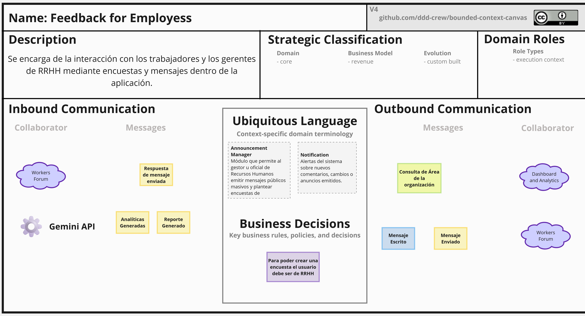

### 4.1.2. Context Mapping {#context-mapping}

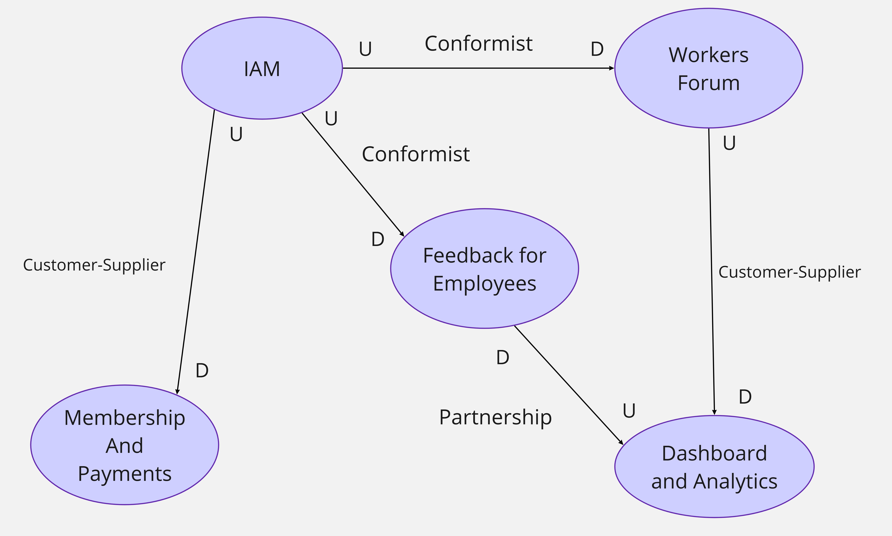

####  IAM - Workers Forum (Conformist)
- En esta relación, IAM es Upstream ya que provee las identidades de los usuarios para el acceso al foro. 

- Worker Forum es Downstream, ya que consume información del Bounded Context IAM.

- La relación es Conformist ya que el contexto en el que se encuentran se alinean según las reglas y estándares establecidos entre las dos.

####  IAM - Feedback for Employees (Conformist)
- En esta relación, IAM es Upstream ya que provee las identidades de los usuarios para visualizar la información de los usuarios registrados dentro de cada área de la organización. 

- Feedback for Employees es Downstream, ya que consume información del Bounded Context IAM.

- La relación es Conformist ya que el contexto en el que se encuentran se alinean según las reglas y estándares establecidos entre las dos. Los usuarios registrados tienen que contener la información necesaria dentro de la organización.

####  IAM - Membership and Payments (Customer-Supplier)

- En esta relación, IAM es Upstream ya que provee las identidades de los usuarios para el manejo de las membresías y pagos registrados.

- Membership and Payments es Downstream, ya que consume información del Bounded Context IAM para los usuarios que tengan una membresía.

- La relación es Customer-Supplier ya que IAM como Bounded Context brinda funcionalidades que el Bounded Context de Membership and Payments consume para realizar sus propias operaciones.

####  Feedback for Employees - Dashboard and Analytics (Partnership)

- En esta relación, Feedback for Employees es Downstream ya que consumme información del Bounded Context Dashborad and Analytics para poder realizar el feedback a los trabajadores de una área.

- Dashborad and Analytics es Upstream, ya que consume información directa de este Bounded Context. Esto se debe a el tipo de encuestas que se le realiza al empleado se podrá realizar el feeback necesario.

- La relación es Partnership, porque ambos Bounded Context colaboran para poder coexistir por un objetivo en común.

####  Workers Forum - Dashboard and Analytics (Customer-Supplier)

- En esta relación, Workers Forum es Upstream ya que provee funcionalidades y data para el Bounded Context de Dashborad and Analytics. 

-  Dashborad and Analytics es Downstream, ya que la información que llegue del otro Bounded Context es vital y funcional para este contexto.

- La relación es Customer-Supplier ya que ambos contextos proveen funcionalidades y información para ambos Bounded Context. 

### 4.1.3. Software Architecture {#software-architecture}

#### 4.1.3.1. Software Architecture Context Level Diagrams {#software-architecture-context-level-diagrams}

Para el diagrama de Contexto, se muestra la relación entre el sistema y los actores externos que interactuan con él. En este caso, los trabajadores, que interactuan y comparten experiencias con otros trabajadores y Gerentes de RRHH que escuchan y supervisan el comporatamiento dentro del entorno laboral. También se incluyen servicios a utilizar, como el servicio de notificaciones (envíos de correo/SMS hacia el usuario) y el servicio de pagos que será utilizado en el contexto de membresías.

#### 4.1.3.2. Software Architecture Container Level Diagrams {#software-architecture-container-level-diagrams}

El diagrama de contenedores representa los principales componentes del sistema y cómo interactuan entre sí. Se muestra la aplicación móvil para los trabajadores y los gerentes de RRHH, el gestor de backend que centraliza la lógica de negocio y los Bounded Context, como la base de datos y la integración con distintos servicios.

#### 4.1.3.3. Software Architecture Deployment Diagrams {#software-architecture-deployment-diagrams}
El siguiente diagrama de despliegue muestra la infraestructura física y lógica que se ejecutan los principales componentes del sistema.

## 4.2. Tactical-Level Domain-Driven Design {#tactical-level-domain-driven-design}

### 4.2.1. Bounded Context: Identity and Access Management
#### 4.2.1.1. Domain Layer  
#### 4.2.1.2. Interface Layer
#### 4.2.1.3. Application Layer
#### 4.2.1.4  Infrastructure Layer
#### 4.2.1.5. Bounded Context Software Architecture Component Level Diagrams 
#### 4.2.1.6. Bounded Context Software Architecture Code Level Diagrams
#### 4.2.1.6.1. Bunded Context Domain Layer Class Diagrams 
#### 4.2.1.6.2. Bounded Context Database Design Diagram 

### 4.2.2. Bounded Context: Subscription and Payments Management
#### 4.2.2.1. Domain Layer  
#### 4.2.2.2. Interface Layer
#### 4.2.2.3. Application Layer
#### 4.2.2.4  Infrastructure Layer
#### 4.2.2.5. Bounded Context Software Architecture Component Level Diagrams 
#### 4.2.3.6. Bounded Context Software Architecture Code Level Diagrams
#### 4.2.3.6.1. Bunded Context Domain Layer Class Diagrams 
#### 4.2.3.6.2. Bounded Context Database Design Diagram 

### 4.2.3. Bounded Context: Workers Forum
#### 4.2.3.1. Domain Layer  
#### 4.2.3.2. Interface Layer
#### 4.2.3.3. Application Layer
#### 4.2.3.4  Infrastructure Layer
#### 4.2.3.5. Bounded Context Software Architecture Component Level Diagrams 
#### 4.2.3.6. Bounded Context Software Architecture Code Level Diagrams
#### 4.2.3.6.1. Bunded Context Domain Layer Class Diagrams 
#### 4.2.3.6.2. Bounded Context Database Design Diagram 

### 4.2.4. Bounded Context: Dashboard and Analytics 
#### 4.2.4.1. Domain Layer  
#### 4.2.4.2. Interface Layer
#### 4.2.4.3. Application Layer
#### 4.2.4.4  Infrastructure Layer
#### 4.2.4.5. Bounded Context Software Architecture Component Level Diagrams 
#### 4.2.4.6. Bounded Context Software Architecture Code Level Diagrams
#### 4.2.4.6.1. Bunded Context Domain Layer Class Diagrams 
#### 4.2.4.6.2. Bounded Context Database Design Diagram 

### 4.2.5. Bounded Context: Feedback for Workers
#### 4.2.5.1. Domain Layer  
#### 4.2.5.2. Interface Layer
#### 4.2.5.3. Application Layer
#### 4.2.5.4  Infrastructure Layer
#### 4.2.5.5. Bounded Context Software Architecture Component Level Diagrams 
#### 4.2.5.6. Bounded Context Software Architecture Code Level Diagrams
#### 4.2.5.6.1. Bunded Context Domain Layer Class Diagrams 
#### 4.2.5.6.2. Bounded Context Database Design Diagram 

### 4.2.6. Bounded Context: <Bounded Context Name> 
#### 4.2.6.1. Domain Layer  
#### 4.2.6.2. Interface Layer
#### 4.2.6.3. Application Layer
#### 4.2.6.4  Infrastructure Layer
#### 4.2.6.5. Bounded Context Software Architecture Component Level Diagrams 
#### 4.2.6.6. Bounded Context Software Architecture Code Level Diagrams
#### 4.2.6.6.1. Bunded Context Domain Layer Class Diagrams 
#### 4.2.6.6.2. Bounded Context Database Design Diagram 
